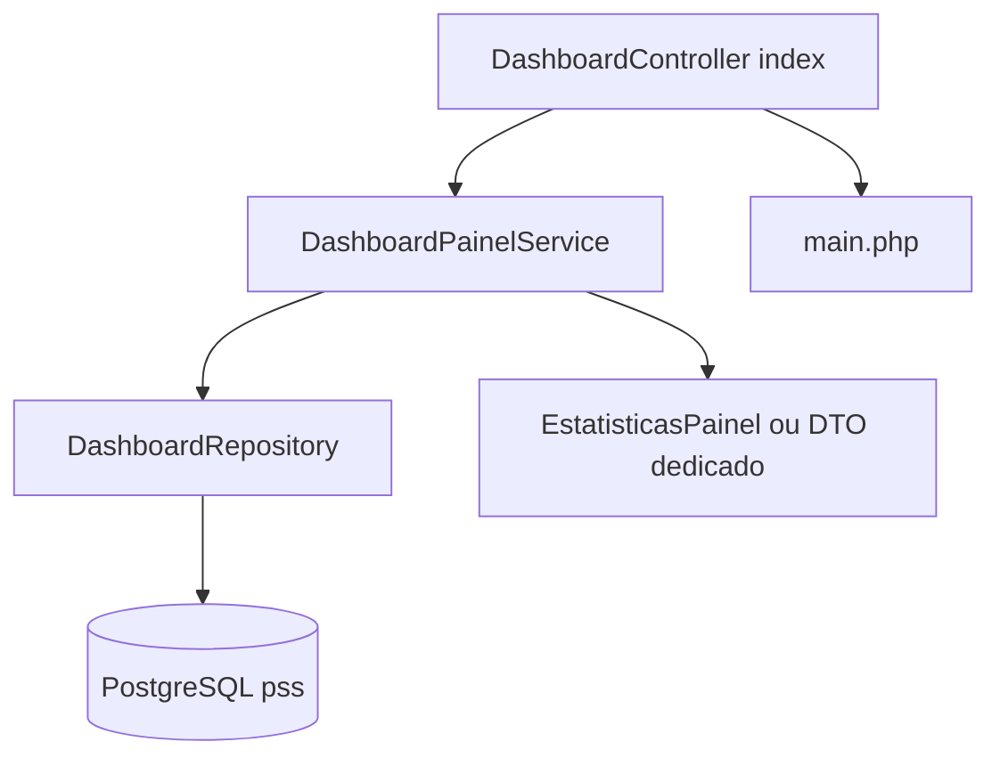

# Plano: dados do BD na home do dashboard (MVC + Service + Repository)

Referência obrigatória: [.cursor/rules/regras-mvc.rules](.cursor/rules/regras-mvc.rules).

## Regras aplicáveis a esta entrega

- **Fluxo:** `Controller → Service → Repository → Banco` (nunca Controller → Model com SQL).
- **Model (`app/models`):** apenas propriedades / estrutura de dados; **proibido SQL** e regras de negócio nas classes novas criadas para o painel.
- **Repository (`app/repositories`):** único lugar para **SELECT/COUNT** usados nesta feature; usar `App\core\Database` (PDO) como no resto do projeto.
- **Service (`app/services`):** orquestra repositórios, aplica regras (ex.: limite de itens na lista, mapeamento de status para label), pode lançar exceções.
- **Controller:** HTTP + chamar Service + `view(..., $data)`; **sem SQL** e sem lógica pesada.
- **Evitar** novos métodos estáticos “para tudo”; preferir **instâncias** nos novos artefatos, alinhado à regra 6.
- **Nomenclatura:** na camada nova usar prefixo **Dashboard** (ex.: `DashboardRepository`, `DashboardPainelService`), **não** nomes do tipo `PssDashboard` / `PssRepository` para estes artefatos.
- **Legado:** a classe existente [`PssDashboard`](app/models/PssDashboard.php) (e similares) **já contém SQL** e não obedece ao modelo ideal. Para esta tarefa **não** se acrescenta lógica nova nela; o código novo fica em **DashboardRepository + DashboardPainelService**. Renomear globalmente `PssDashboard` → outro nome fica como **tarefa opcional separada** (muitos `use`/`new` no projeto).

Autoload: `composer.json` já mapeia `App\\` → `app/`, logo `App\repositories\...` e `App\services\...` resolvem em `app/repositories/` e `app/services/` após criar as pastas.

## Situação da view e do controller

- [`app/views/dashboard/main.php`](app/views/dashboard/main.php): valores fixos e um processo estático; deve passar a consumir apenas variáveis vindas do Plates (sem acesso à BD na view).
- [`app/controllers/DashboardController.php`](app/controllers/DashboardController.php): `index()` hoje chama `view('dashboard/main')` sem dados; deve chamar um **Service** e repassar o array/DTO já preparado.

## Dados a expor (domínio já refletido no legado)

| Apresentação | Origem no BD | Responsável na arquitetura nova |
|--------------|--------------|-----------------------------------|
| Processos ativos / em andamento | `COUNT(*)` em `pss.pss` com `status_global = 'em_andamento'` | `DashboardRepository` (método dedicado, ex. `contarProcessosPorStatusGlobal`) |
| Candidatos | `COUNT(*)` em `pss.candidato` | `DashboardRepository` (ex. `contarCandidatos`) |
| Inscrições | `COUNT(*)` em `pss.inscricao` com `status_inscricao = 'Ativa'` (coerente com [`InscricaoDashboard`](app/models/InscricaoDashboard.php)) | `DashboardRepository` (ex. `contarInscricoesAtivas`) |
| Lista “Processos em Andamento” | Linhas de `pss.pss` com filtro `em_andamento`, **LIMIT** definido no Service | `DashboardRepository` (ex. `listarProcessosPorStatusGlobal`) + montagem do DTO no `DashboardPainelService` |

## Desenho de classes (proposta)

1. **DTO / model de leitura (só dados)**  
   Ex.: classe `EstatisticasPainel` (ou `PainelInicialViewModel`) com propriedades tipadas: totais inteiros + `array` de objetos leves do tipo “processo em listagem” (id, titulo, datas, status_global). Sem construtor com query; pode ter construtor simples ou setters apenas se fizer sentido.

2. **`DashboardRepository` (`app/repositories/DashboardRepository.php`)**  
   - Um repositório agregador do **painel** (nomenclatura *dashboard*, não *pss* no nome da classe).  
   - Métodos explícitos orientados ao domínio do ecrã, ex.: `contarProcessosPorStatusGlobal(string $status): int`, `listarProcessosPorStatusGlobal(string $status, int $limite, string $ordem): array`, `contarCandidatos(): int`, `contarInscricoesAtivas(): int`.  
   - Retornar arrays associativos; o Service monta o DTO (Repository sem regra de negócio).

3. **`DashboardPainelService` (`app/services/DashboardPainelService.php`)**  
   - `obterResumo(): EstatisticasPainel` (ou nome equivalente do DTO).  
   - Usa apenas `DashboardRepository`; define `LIMITE_PROCESSOS_HOME` (constante ou config).  
   - Opcional: `try/catch` e retorno seguro (zeros + lista vazia) conforme política de erro do projeto.

4. **Controller**  
   - `$this->view('dashboard/main', $service->obterResumo()->toArray())` ou passar o objeto se o Plates aceitar propriedades públicas de forma conveniente.

5. **View**  
   - Substituir números fixos por escape seguro (`htmlspecialchars` / `number_format` pt-BR).  
   - `foreach` na lista de processos; datas formatadas na view ou já formatadas no Service (regra de apresentação: preferir uma única convenção).  
   - Link “Ver Todos” → [`/dashboard/processos`](app/routes/Router.php).  
   - Revisar fechamento de `
` no final de `main.php` para bater com o layout em [`template.php`](app/views/dashboard/template.php).

## Critérios de aceitação

- Nenhum SQL novo em `app/models` para esta feature.  
- `DashboardController::index` contém apenas chamada ao Service e renderização.  
- Repositórios contêm apenas acesso a dados; Service concentra orquestração e limites.  
- Home reflete contagens e lista reais da BD.

## Nota sobre migração futura

Extrair gradualmente o SQL de `PssDashboard` / `InscricaoDashboard` / `Candidato` para `DashboardRepository` (ou repositórios por entidade) pode ser feito em tarefas separadas. **Renomear** o ficheiro/classe `PssDashboard` para algo como `DashboardPssLegacy` é opcional e exige alteração em todos os controladores que hoje a instanciam — fora do mínimo desta entrega.
